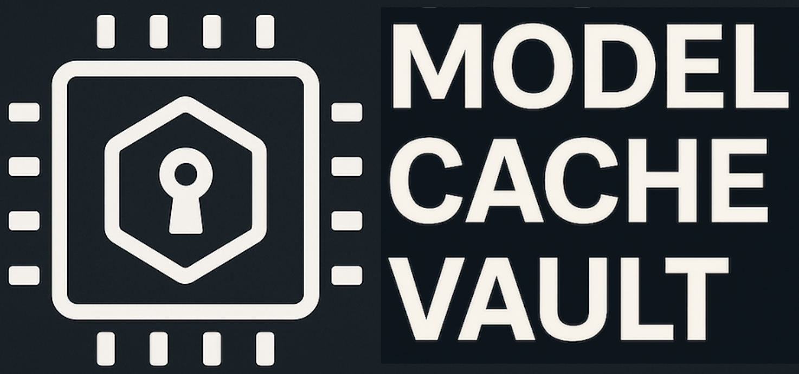

# Model Cache Vault (MCV)



A Model/GPU kernel cache container packaging utility inspired by
[WASM](https://github.com/solo-io/wasm/blob/master/spec/README.md).

## Features

- Build container images containing GPU Kernel/Model caches.
- Extract a cache from an OCI image
- Compatible with docker or buildah
- Client API for retrieving and extracting images
- Artifact and image signing via cosign (indirectly)

### Kernel Cache artifact and image signing

- Cache artifact signing with with Cosign (intoto)
- Container image signing support with Cosign

## Build Instructions

Install dependencies:

```bash
sudo dnf install gpgme-devel
sudo dnf install btrfs-progs-devel
```

Build the binary:

```bash
make build
```

After the binary is built, it can be found in an arch specific directory,
something like `./_output/bin/linux_amd64/mcv`. To install the binary in
the local `~/go/bin` directory, run (make sure `~/go/bin` is in $PATH):

```bash
make install
```

## Usage

Below is the `mcv` usage:

```bash
$ mcv -h
A Model cache container image management utility

Usage:
  mcv [flags]

Flags:
  -b, --baremetal          Run baremetal preflight checks
  -c, --create             Create OCI image
  -d, --dir string         A Cache Directory
  -e, --extract            Extract a cache from an OCI image
  -h, --help               help for mcv
  -i, --image string       OCI image name
  -l, --log-level string   Set the logging verbosity level: debug, info, warning or error
      --no-gpu             Allow kernel extraction without GPU present (for testing purposes)
```

> NOTE: The create option is a work in progress.
> For now to create an OCI image containing a GPU Kernel cache directory please
> follow the instructions in [spec-compat.md](./docs/spec-compat.md).

## Dependencies

- [buildah dependencies](https://github.com/containers/buildah/blob/main/install.md#building-from-scratch)

## GPU Kernel Image Container Specification

### Cache Image Container Specification

The Cache Image specification defines how to bundle caches
as container images. A compatible Cache image consists of cache
directory for a Triton Kernel/vLLM model. The details can be found in
[spec-compat.md](./spec-compat.md)

### Example

To extract the Triton Cache for the
[01-vector-add.py](https://github.com/triton-lang/triton/blob/main/python/tutorials/01-vector-add.py)
tutorial from [Triton](https://github.com/triton-lang/triton), run the following:

```bash
mcv -e -i quay.io/gkm/vector-add-cache:rocm
Img fetched successfully!!!!!!!!
Img Digest: sha256:b6d7703261642df0bf95175a64a01548eb4baf265c5755c30ede0fea03cd5d97
Img Size: 525
bash-4.4#
```

This will extract the cache directory from the `quay.io/gkm/vector-add-cache:rocm`
container image and copy it to  `~/.triton/cache/`.

To Create an OCI image for a Triton Cache using docker run the following:

```bash
mcv -c -i quay.io/gkm/vector-add-cache:rocm -d example/vector-add-cache-rocm
INFO[2025-05-28 11:09:33] baremetalFlag false
INFO[2025-05-28 11:09:33] Using docker to build the image
INFO[2025-05-28 11:09:33] Wrote manifest to /tmp/.mcv/io.triton.manifest/manifest.json
INFO[2025-05-28 11:09:33] Dockerfile generated successfully at /tmp/.mcv/Dockerfile
{"stream":"Step 1/7 : FROM scratch"}
{"stream":"\n"}
{"stream":" ---\u003e \n"}
{"stream":"Step 2/7 : LABEL org.opencontainers.image.title=vector-add-cache"}
{"stream":"\n"}
{"stream":" ---\u003e Running in fe2ead6429b6\n"}
{"stream":" ---\u003e 729d29d1eab1\n"}
{"stream":"Step 3/7 : COPY \"io.triton.cache/.\" ./io.triton.cache/"}
{"stream":"\n"}
{"stream":" ---\u003e e806e7b6def5\n"}
{"stream":"Step 4/7 : COPY \"io.triton.manifest/manifest.json\" ./io.triton.manifest/manifest.json"}
{"stream":"\n"}
{"stream":" ---\u003e 68cbd692cef2\n"}
{"stream":"Step 5/7 : LABEL cache.triton.image/cache-size-bytes=80415"}
{"stream":"\n"}
{"stream":" ---\u003e Running in 3f80c2250345\n"}
{"stream":" ---\u003e 7eb9a67e385e\n"}
{"stream":"Step 6/7 : LABEL cache.triton.image/entry-count=1"}
{"stream":"\n"}
{"stream":" ---\u003e Running in da8a4e1461d0\n"}
{"stream":" ---\u003e 9f0b331cc5be\n"}
{"stream":"Step 7/7 : LABEL cache.triton.image/summary={\"targets\":[{\"backend\":\"hip\",\"arch\":\"gfx90a\",\"warp_size\":64}]}"}
{"stream":"\n"}
{"stream":" ---\u003e Running in 4772e3c43256\n"}
{"stream":" ---\u003e c144a34c9296\n"}
{"aux":{"ID":"sha256:c144a34c9296b2a7ec322e041bf9fb8e29111ba9d071ef5e6e31618fb2e528e4"}}
{"stream":"Successfully built c144a34c9296\n"}
{"stream":"Successfully tagged quay.io/gkm/vector-add-cache:rocm\n"}
INFO[2025-05-28 11:09:34] Temporary directories successfully deleted.
INFO[2025-05-28 11:09:34] Docker image built successfully
INFO[2025-05-28 11:09:34] OCI image created successfully.
```

To see the new image:

```bash
 docker images
REPOSITORY                     TAG     IMAGE ID       CREATED          SIZE
quay.io/tkm/vector-add-cache   latest  32572653bbbd   5 minutes ago    0B
```

To inspect the docker image with Skopeo

```bash
skopeo inspect docker-daemon:quay.io/gkm/vector-add-cache:rocm
{
    "Name": "quay.io/tkm/vector-add-cache",
    "Digest": "sha256:326c155c3d6de9d285b0280d141cb75f1fd48475b410e19f4aef0b395b400ced",
    "RepoTags": [],
    "Created": "2025-05-28T15:09:34.032834736Z",
    "DockerVersion": "28.1.1",
    "Labels": {
        "cache.triton.image/cache-size-bytes": "80415",
        "cache.triton.image/entry-count": "1",
        "cache.triton.image/summary": "{\"targets\":[{\"backend\":\"hip\",\"arch\":\"gfx90a\",\"warp_size\":64}]}",
        "org.opencontainers.image.title": "vector-add-cache"
    },
    "Architecture": "amd64",
    "Os": "linux",
    "Layers": [
        "sha256:fe1632cee6d6de159c5c36233c73fbbaa9196af69d771fe016ae4b3a0b6ea698",
        "sha256:a53fd74714b8956ec2d2e02c4c262e6800bc45b0a8f5e339923ea3baa2d1f1ff"
    ],
    "LayersData": [
        {
            "MIMEType": "application/vnd.docker.image.rootfs.diff.tar.gzip",
            "Digest": "sha256:fe1632cee6d6de159c5c36233c73fbbaa9196af69d771fe016ae4b3a0b6ea698",
            "Size": 91648,
            "Annotations": null
        },
        {
            "MIMEType": "application/vnd.docker.image.rootfs.diff.tar.gzip",
            "Digest": "sha256:a53fd74714b8956ec2d2e02c4c262e6800bc45b0a8f5e339923ea3baa2d1f1ff",
            "Size": 2560,
            "Annotations": null
        }
    ],
    "Env": [
        "PATH=/usr/local/sbin:/usr/local/bin:/usr/sbin:/usr/bin:/sbin:/bin"
    ]
}
```

> **Note**: If `buildah` is installed it will be favoured to build the image.
The build output is shown below.

```bash
mcv -c -i quay.io/gkm/vector-add-cache:rocm -d example/vector-add-cache-rocm
INFO[2025-05-28 12:23:04] baremetalFlag false
INFO[2025-05-28 12:23:04] Using buildah to build the image
INFO[2025-05-28 12:23:04] Wrote manifest to /tmp/buildah-manifest-dir-2780945232/manifest.json
INFO[2025-05-28 12:23:04] Image built! baadff55392c0ada6f0d358c255d63ca770fb20b87429a732480e00bbf8d044b
INFO[2025-05-28 12:23:04] Temporary directories successfully deleted.
INFO[2025-05-28 12:23:04] OCI image created successfully.
```

To inspect the buildah image with Skopeo

```bash
skopeo inspect containers-storage:quay.io/gkm/vector-add-cache:rocm
{
    "Name": "quay.io/tkm/vector-add-cache",
    "Digest": "sha256:3f8c7b3aeeffd9ee3f673486f3bc681a7f9ed39e21242628e6845755191d6bd4",
    "RepoTags": [],
    "Created": "2025-05-28T15:45:17.379786001Z",
    "DockerVersion": "",
    "Labels": {
        "cache.triton.image/cache-size-bytes": "80415",
        "cache.triton.image/entry-count": "1",
        "cache.triton.image/summary": "{\"targets\":[{\"backend\":\"hip\",\"arch\":\"gfx90a\",\"warp_size\":64}]}"
    },
    "Architecture": "amd64",
    "Os": "linux",
    "Layers": [
        "sha256:ef89050f71ecc3dc925f14c12d2fd406c067f78987eed36a1176b19499c8ea20"
    ],
    "LayersData": [
        {
            "MIMEType": "application/vnd.oci.image.layer.v1.tar",
            "Digest": "sha256:ef89050f71ecc3dc925f14c12d2fd406c067f78987eed36a1176b19499c8ea20",
            "Size": 93184,
            "Annotations": null
        }
    ],
    "Env": null
}
```

To inspect the image labels specifically run:

```bash
skopeo inspect containers-storage:quay.io/gkm/vector-add-cache:rocm | jq -r '.Labels["cache.triton.image/summary"]' | jq .
{
  "targets": [
    {
      "backend": "hip",
      "arch": "gfx90a",
      "warp_size": 64
    }
  ]
}
```

## Signing Container Images

Use [Sigstore Cosign](https://docs.sigstore.dev/) to sign mcv-built images.

1. Install Cosign

```bash
go install github.com/sigstore/cosign/v2/cmd/cosign@latest
```

2. Sign an image

```bash
cosign sign -y quay.io/tkm/vector-add-cache@sha256:<digest>
⏎
Generating ephemeral keys...
Retrieving signed certificate...

    The sigstore service, hosted by sigstore a Series of LF Projects, LLC, is provided pursuant to the Hosted Project Tools Terms of Use, available at https://lfprojects.org/policies/hosted-project-tools-terms-of-use/.
    Note that if your submission includes personal data associated with this signed artifact, it will be part of an immutable record.
    This may include the email address associated with the account with which you authenticate your contractual Agreement.
    This information will be used for signing this artifact and will be stored in public transparency logs and cannot be removed later, and is subject to the Immutable Record notice at https://lfprojects.org/policies/hosted-project-tools-immutable-records/.

By typing 'y', you attest that (1) you are not submitting the personal data of any other person; and (2) you understand and agree to the statement and the Agreement terms at the URLs listed above.
Your browser will now be opened to:
...
```

Cosign will prompt you to authenticate and display legal terms regarding
transparency logs.

3. Confirm and Finish
    - Ephemeral keys will be generated
    - Signature will be pushed to the registry
    - You'll see a success message including the transparency log index

Upon successful completion, you will see an output similar to:

```bash
Successfully verified SCT...
tlog entry created with index: 215011903
Pushing signature to: quay.io/mtahhan/01-vector-add-cache
```

## Client API

An example snippet of how to use the client API to extract a Cache
from a container image is shown below.

```go
import (
    "github.com/redhat-et/TKDK/mcv/pkg/client"
)

func main() {
    enableGPU := false // for real use case should be true... or will default to true if not set
    enableBaremetal := false

    err := client.ExtractCache(client.Options{
        ImageName:       "quay.io/mtahhan/01-vector-add-cache:latest",
        CacheDir:        "/tmp/testcache",
        EnableGPU:       &enableGPU,
        LogLevel:        "debug",
        EnableBaremetal: &enableBaremetal,
    })
    if err != nil {
        panic(err)
    }
}
```

You can also use the TKDK client API to retrieve details about the system's
available GPUs:

```go
package main

import (
    "encoding/json"
    "fmt"
    "log"

    "github.com/redhat-et/TKDK/mcv/pkg/client"
)

func main() {
    gpus, err := client.GetSystemGPUInfo()
    if err != nil {
        log.Fatalf("Error retrieving GPU info: %v", err)
    }

    output, err := json.MarshalIndent(gpus, "", "  ")
    if err != nil {
        log.Fatalf("Failed to format GPU info: %v", err)
    }

    fmt.Println("Detected GPU Devices:")
    fmt.Println(string(output))
}
```
