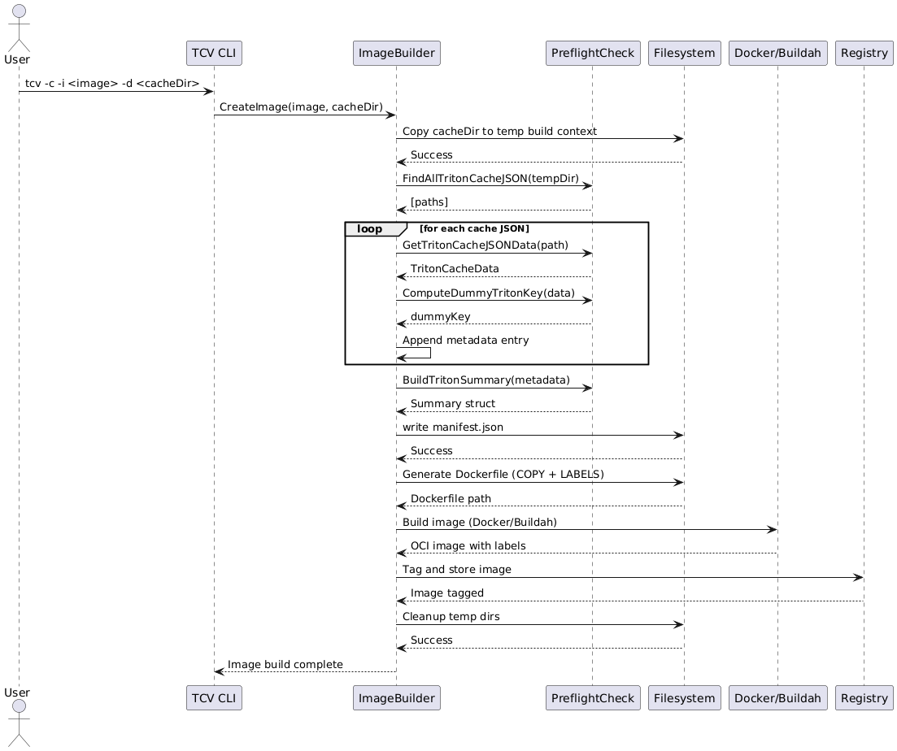
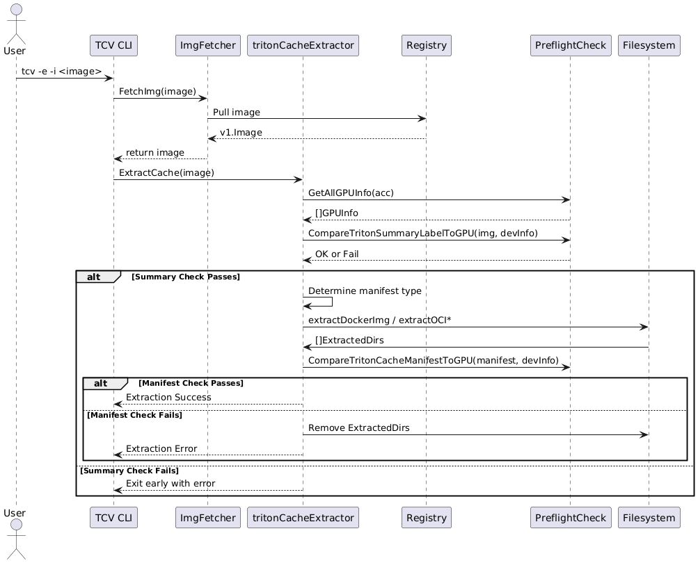

# Model Cache Vault (MCV) - Design Document

## Overview

**MCV** (Model Cache Vault) is a utility for packaging, validating,
and extracting prebuilt Model caches using OCI container
images. It supports GPU hardware preflight checks, cache manifest
validation, and developer-friendly debugging workflows.

## Goals

- Package prebuilt Triton or vLLM caches into OCI-compatible container images.
- Validate kernel or model caches against the host GPU for compatibility.
- Support multiple container image formats, including Docker and OCI standard.
- Extract and validate cache contents via:
  - Kernel metadata summary (for fast checks)
  - Full manifest analysis (for detailed checks)

## Supported Image Formats
<!-- markdownlint-disable  MD013 -->
<!-- Teporarily disable MD013 - Line length to keep the table formatting  -->
| Format Type         | Description                         | Media Type(s)                                       | Support |
|---------------------|-------------------------------------|-----------------------------------------------------|---------|
| **Docker V2 Schema**| Standard Docker images              | `application/vnd.docker.image.rootfs.diff.tar.gzip` | ✅      |
| **OCI Standard**    | OCI images via tools like `buildah` | `application/vnd.oci.image.layer.v1.tar`            | ✅      |
<!-- markdownlint-enable MD013 -->

## Key Features

- **Triton Support**: Supports Triton cache packaging and extraction.
- **vLLM Support**: Supports vLLM model cache packaging and extraction.
- **Cache Summary Validation**: Checks image metadata labels before
  extraction.
- **Full Manifest Validation**: Parses and validates a detailed manifest
  after extraction.
- **GPU Compatibility Checks**: Verifies compatibility of kernel cache
  against local GPUs using backend, architecture, warp size, and optionally
  PTX versions.
- **Clean Extraction**: Extracted kernels are cleaned up if they are not
  compatible.
- **Temporary Directories**: All staging operations occur in `/tmp/.mcv/*`
  to prevent host pollution.

## Image Label Schema

### Generic Labels (Always Present)

<!-- markdownlint-disable  MD013 -->
<!-- Teporarily disable MD013 - Line length to keep the table formatting  -->
| Label                                   | Description                                      |
|-----------------------------------------|--------------------------------------------------|
| `model.cache.image/type`                | Primary cache type (e.g. `triton`, `vllm`)       |
| `model.cache.image/components`          | JSON array of included components                |
| `model.cache.image/entry-count`         | Total number of entries across all components    |
| `model.cache.image/cache-size-bytes`    | Combined cache directory size in bytes           |
| `model.cache.image/summary`             | Summary of supported targets (e.g. arch/backend) |

### Component-Specific Labels (Conditional)

| Label                                     | Description                           |
|-------------------------------------------|---------------------------------------|
| `cache.triton.image/entry-count`          | Number of Triton kernel cache entries |
| `cache.triton.image/summary`              | Summary of Triton-compatible targets  |
| `cache.vllm.image/entry-count`            | Number of vLLM model cache files      |
| `cache.vllm.image/summary`                | Summary of vLLM metadata              |

> **Note**: These labels are only included if the corresponding cache type is detected.

<!-- markdownlint-enable MD013 -->

## Workflow Summary

### Creating an Image

```bash
mcv -c -i quay.io/example/triton-kernel -d /path/to/.triton/cache
```

- Copies kernel cache into build context
- Writes manifest.json with entry metadata
- Builds Docker or OCI image using Docker or Buildah
- Labels image with summary + entry count

### Extracting and Validating

```bash
mcv -e -i quay.io/example/triton-kernel
```

- Downloads image
- Compares summary label to local GPU
- Extracts image if compatible
- Validates manifest
- Removes incompatible kernels if manifest fails

## Debugging & Logging

- Logging level configurable via `--log-level`
- Temporary cache lives under `/tmp/.mcv/`
- Kernel cache extracted under `~/.triton/cache/`

## Sequence Diagrams

### Image Creation



### Image Extraction


