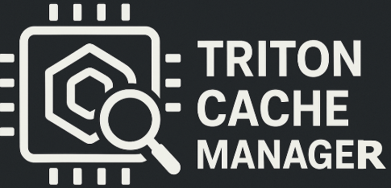

# Triton Cache Manager (TCM)



Triton Cache Manager (TCM) is a lightweight CLI for **indexing, searching, and
managing Triton GPU‑kernel caches**. It helps you organise, prune, and pre‑warm
caches to improve runtime efficiency and save disk space.

---

## Table of Contents

- [Features](#features)
- [Installation](#installation)
- [Quick Start](#quick-start)
- [Usage](#usage)
  - [Indexing the Cache](#indexing-the-cache)
  - [Listing Kernels](#listing-kernels)
  - [Pruning Kernels](#pruning-kernels)
  - [Warming the Cache](#warming-the-cache)
- [Requirements](#requirements)
- [Project Structure](#project-structure)

---

## Features

TCM offers the following capabilities:

- **Cache Indexing** – Scan a Triton cache directory and build a local
  database that records kernel name, backend, architecture, and file sizes.
- **Flexible Search and Listing** – Query kernels by name, backend (for
  example *CUDA* or *ROCm*), architecture, or modification time.
- **Intelligent Pruning**
  - **IR‑only mode** – Remove intermediate‑representation files while leaving
    binaries intact.
  - **Full deletion** – Remove the entire kernel directory and its database
    record.
  - **Deduplication** – Keep only the newest copy of each unique kernel.
- **Cache Warming** – Pre‑fill the vLLM cache in a container (CUDA or ROCm) and
  optionally export it as a tarball.
- **Human‑readable Output** – Show kernel details in well‑formatted tables with
  readable file sizes and timestamps.

---

## Installation

### Prerequisites

- Python 3.9 or newer
- Triton
- [Podman](https://podman.io/) (needed for `tcm warm`)

### Installation Steps

1. Install in editable mode

   ```bash
   pip install -e .
   ```

   The command installs TCM and its dependencies (`typer`, `rich`, `sqlalchemy`,
   and `pydantic`) and adds the `tcm` command to your PATH.

---

## Quick Start

1. Index your cache

   ```bash
   tcm index --cache-dir ~/.triton/cache   # or your custom path
   ```

2. List kernels by backend

   ```bash
   tcm list --backend cuda
   ```

---

## Usage

The `tcm` CLI groups its functionality into sub‑commands.

### Indexing the Cache

The `index` sub‑command scans the cache and populates the database.

```bash
tcm index [OPTIONS]
```

#### Options

- `--cache-dir PATH` – Path to the cache (default `~/.triton/cache`)

#### Example

```bash
tcm index --cache-dir /path/to/my/cache
```

### Listing Kernels

Search and display kernels that match one or more filters.

```bash
tcm list [OPTIONS]
```

#### Listing Options

- `--name, -n TEXT`     Kernel name (exact match)
- `--backend, -b TEXT`  Backend (`cuda`, `rocm`, …)
- `--arch, -a TEXT`     Architecture (`80`, `gfx90a`, …)
- `--older-than TEXT`   Only kernels older than the given duration
- `--younger-than TEXT` Only kernels younger than the given duration
- `--cache-dir PATH`    Cache directory to search

#### Examples

- List all CUDA kernels

  ```bash
  tcm list --backend cuda
  ```

- Kernels named `my_custom_kernel` older than 30 days

  ```bash
  tcm list --name my_custom_kernel --older-than 30d
  ```

- ROCm kernels for architecture `gfx90a`

  ```bash
  tcm list --backend rocm --arch gfx90a
  ```

### Pruning Kernels

Remove kernels from the cache. Supports IR‑only, full deletion, and
deduplication.

```bash
tcm prune [OPTIONS]
```

#### Pruning Options

- `--name, -n TEXT`     Kernel name
- `--backend, -b TEXT`  Backend
- `--arch, -a TEXT`     Architecture
- `--older-than TEXT`   Delete kernels older than the duration
- `--younger-than TEXT` Delete kernels younger than the duration
- `--full`              Delete the entire kernel directory
- `--deduplicate`       Keep only the newest copy of each kernel
- `-y, --yes`           Skip the confirmation prompt
- `--cache-dir PATH`    Cache directory

#### Pruning Examples

- IR files older than 90 days

  ```bash
  tcm prune --older-than 90d
  ```

- Fully remove all `unstable_kernel` entries

  ```bash
  tcm prune --name unstable_kernel --full -y
  ```

- Deduplicate the cache

  ```bash
  tcm prune --deduplicate -y
  ```

### Warming the Cache

Run a container that generates a vLLM cache for a model and optionally export
it.

```bash
tcm warm [OPTIONS]
```

#### Warming Options

- `--model, -m TEXT`         Hugging Face model (default `facebook/opt-125m`)
- `--output, -o PATH`        Output tarball (default `warmed_cache.tar.gz`)
- `--host-cache-dir PATH`    Host directory for the cache (default `./`)
- `--hugging-face-token TEXT` Token for private models
- `--vllm_cache_dir PATH`    Cache path inside the container
- `--tarball`                Produce a gzipped tarball after warming
- `--rocm`                   Warm for ROCm GPUs (default CUDA)

#### Warming Examples

- Warm cache for a model and produce a tarball

  ```bash
  tcm warm --model EleutherAI/gpt-neo-125M \
           --tarball \
           --output my_gpt_neo_cache.tar.gz
  ```

- Warm cache on a ROCm system

  ```bash
  tcm warm --model Llama-3-8B --rocm \
           --hugging-face-token hf_YOUR_TOKEN
  ```

---

## Requirements

TCM depends on the following libraries (installed from `requirements.txt`):

- `typer`
- `rich`
- `pydantic`
- `pydantic-settings`
- `structlog`
- `sqlalchemy`

---

## Project Structure

- `tcm/triton_cache_manager/cli` – CLI entry points
- `tcm/triton_cache_manager/services` – Business logic
- `tcm/triton_cache_manager/data` – Database access and cache repository
- `tcm/triton_cache_manager/models` – DTOs and Pydantic models
- `tcm/triton_cache_manager/plugins` – Backend‑specific handlers
- `tcm/triton_cache_manager/utils` – Logging, paths, helpers
