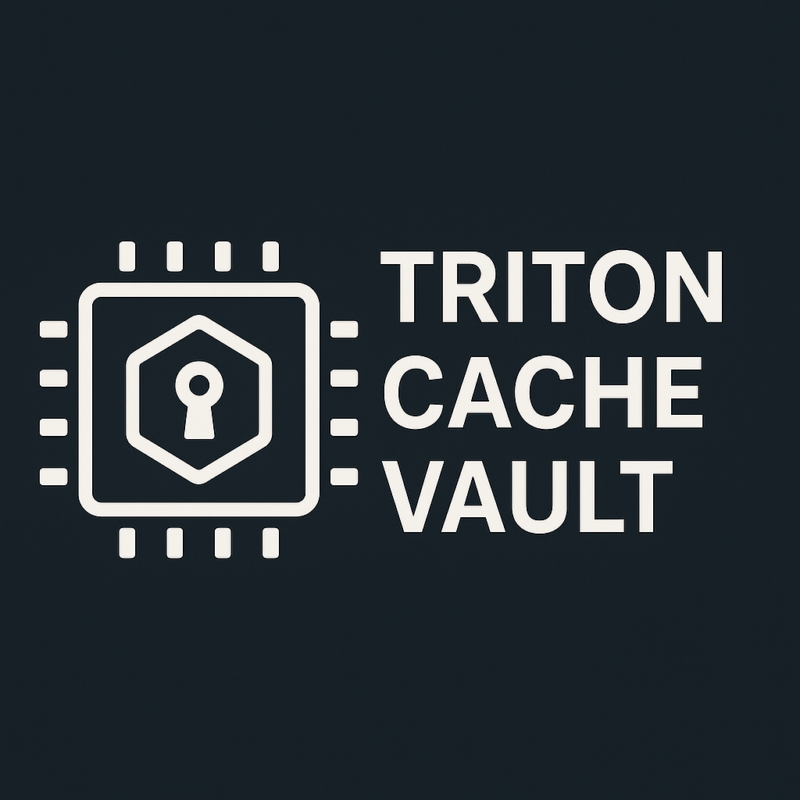

# Triton Cache Vault



A Triton kernel cache container packaging utility inspired by
[WASM](https://github.com/solo-io/wasm/blob/master/spec/README.md).

## Build

```bash
sudo dnf install gpgme-devel
sudo dnf install btrfs-progs-devel
```

```bash
go build
```

## Usage

```bash
$ ./_output/bin/linux_amd64/tcv -h
A GPU Kernel runtime container image management utility

Usage:
  tcv [flags]

Flags:
  -c, --create             Create OCI image
  -d, --dir string         Triton Cache Directory
  -e, --extract            Extract a Triton cache from an OCI image
  -h, --help               help for tcv
  -i, --image string       OCI image name
  -l, --log-level string   Set the logging verbosity level (debug, info, warning or error)
```

> NOTE: The create option is a work in progress. For now
to create an OCI image containing a Triton cache directory
please follow the instructions in
[spec-compat.md](./spec-compat.md).

## Dependencies

- [buildah dependencies](https://github.com/containers/buildah/blob/main/install.md#building-from-scratch)

## Triton Cache Image Container Specification

The Triton Cache Image specification defines how to bundle Triton Caches
as container images. A compatible Triton Cache image consists of cache
directory for a Triton Kernel.

There are two variants of the specification:

- [spec.md](./spec.md)
- [spec-compat.md](./spec-compat.md)

## Example

To extract the Triton Cache for the
[01-vector-add.py](https://github.com/triton-lang/triton/blob/main/python/tutorials/01-vector-add.py)
tutorial from [Triton](https://github.com/triton-lang/triton), run the following:

```bash
./_output/bin/linux_amd64/tcv -e -i quay.io/tkm/vector-add-cache:rocm
Img fetched successfully!!!!!!!!
Img Digest: sha256:b6d7703261642df0bf95175a64a01548eb4baf265c5755c30ede0fea03cd5d97
Img Size: 525
bash-4.4#
```

This will extract the cache directory from the `quay.io/tkm/vector-add-cache:rocm`
container image and copy it to  `~/.triton/cache/`.

To Create an OCI image for a Triton Cache using docker run the following:

```bash
./_output/bin/linux_amd64/tcv -c -i quay.io/tkm/vector-add-cache:rocm -d example/vector-add-cache-rocm
INFO[2025-05-28 11:09:33] baremetalFlag false
INFO[2025-05-28 11:09:33] Using docker to build the image
INFO[2025-05-28 11:09:33] Wrote manifest to /tmp/.tcv/io.triton.manifest/manifest.json
INFO[2025-05-28 11:09:33] Dockerfile generated successfully at /tmp/.tcv/Dockerfile
{"stream":"Step 1/7 : FROM scratch"}
{"stream":"\n"}
{"stream":" ---\u003e \n"}
{"stream":"Step 2/7 : LABEL org.opencontainers.image.title=vector-add-cache"}
{"stream":"\n"}
{"stream":" ---\u003e Running in fe2ead6429b6\n"}
{"stream":" ---\u003e 729d29d1eab1\n"}
{"stream":"Step 3/7 : COPY \"io.triton.cache/.\" ./io.triton.cache/"}
{"stream":"\n"}
{"stream":" ---\u003e e806e7b6def5\n"}
{"stream":"Step 4/7 : COPY \"io.triton.manifest/manifest.json\" ./io.triton.manifest/manifest.json"}
{"stream":"\n"}
{"stream":" ---\u003e 68cbd692cef2\n"}
{"stream":"Step 5/7 : LABEL cache.triton.image/cache-size-bytes=80415"}
{"stream":"\n"}
{"stream":" ---\u003e Running in 3f80c2250345\n"}
{"stream":" ---\u003e 7eb9a67e385e\n"}
{"stream":"Step 6/7 : LABEL cache.triton.image/entry-count=1"}
{"stream":"\n"}
{"stream":" ---\u003e Running in da8a4e1461d0\n"}
{"stream":" ---\u003e 9f0b331cc5be\n"}
{"stream":"Step 7/7 : LABEL cache.triton.image/summary={\"targets\":[{\"backend\":\"hip\",\"arch\":\"gfx90a\",\"warp_size\":64}]}"}
{"stream":"\n"}
{"stream":" ---\u003e Running in 4772e3c43256\n"}
{"stream":" ---\u003e c144a34c9296\n"}
{"aux":{"ID":"sha256:c144a34c9296b2a7ec322e041bf9fb8e29111ba9d071ef5e6e31618fb2e528e4"}}
{"stream":"Successfully built c144a34c9296\n"}
{"stream":"Successfully tagged quay.io/tkm/vector-add-cache:rocm\n"}
INFO[2025-05-28 11:09:34] Temporary directories successfully deleted.
INFO[2025-05-28 11:09:34] Docker image built successfully
INFO[2025-05-28 11:09:34] OCI image created successfully.
```

To see the new image:

```bash
 docker images
REPOSITORY                                                                                TAG                   IMAGE ID       CREATED          SIZE
quay.io/tkm/vector-add-cache                                                       latest                32572653bbbd   5 minutes ago    0B
```

To inspect the docker image with Skopeo

```bash
skopeo inspect docker-daemon:quay.io/tkm/vector-add-cache:rocm
{
    "Name": "quay.io/tkm/vector-add-cache",
    "Digest": "sha256:326c155c3d6de9d285b0280d141cb75f1fd48475b410e19f4aef0b395b400ced",
    "RepoTags": [],
    "Created": "2025-05-28T15:09:34.032834736Z",
    "DockerVersion": "28.1.1",
    "Labels": {
        "cache.triton.image/cache-size-bytes": "80415",
        "cache.triton.image/entry-count": "1",
        "cache.triton.image/summary": "{\"targets\":[{\"backend\":\"hip\",\"arch\":\"gfx90a\",\"warp_size\":64}]}",
        "org.opencontainers.image.title": "vector-add-cache"
    },
    "Architecture": "amd64",
    "Os": "linux",
    "Layers": [
        "sha256:fe1632cee6d6de159c5c36233c73fbbaa9196af69d771fe016ae4b3a0b6ea698",
        "sha256:a53fd74714b8956ec2d2e02c4c262e6800bc45b0a8f5e339923ea3baa2d1f1ff"
    ],
    "LayersData": [
        {
            "MIMEType": "application/vnd.docker.image.rootfs.diff.tar.gzip",
            "Digest": "sha256:fe1632cee6d6de159c5c36233c73fbbaa9196af69d771fe016ae4b3a0b6ea698",
            "Size": 91648,
            "Annotations": null
        },
        {
            "MIMEType": "application/vnd.docker.image.rootfs.diff.tar.gzip",
            "Digest": "sha256:a53fd74714b8956ec2d2e02c4c262e6800bc45b0a8f5e339923ea3baa2d1f1ff",
            "Size": 2560,
            "Annotations": null
        }
    ],
    "Env": [
        "PATH=/usr/local/sbin:/usr/local/bin:/usr/sbin:/usr/bin:/sbin:/bin"
    ]
}
```

> **Note**: If `buildah` is installed it will be favoured to build the image.
The build output is shown below.

```bash
./_output/bin/linux_amd64/tcv -c -i quay.io/tkm/vector-add-cache:rocm -d example/vector-add-cache-rocm
INFO[2025-05-28 12:23:04] baremetalFlag false
INFO[2025-05-28 12:23:04] Using buildah to build the image
INFO[2025-05-28 12:23:04] Wrote manifest to /tmp/buildah-manifest-dir-2780945232/manifest.json
INFO[2025-05-28 12:23:04] Image built! baadff55392c0ada6f0d358c255d63ca770fb20b87429a732480e00bbf8d044b
INFO[2025-05-28 12:23:04] Temporary directories successfully deleted.
INFO[2025-05-28 12:23:04] OCI image created successfully.
```

To inspect the buildah image with Skopeo

```bash
skopeo inspect containers-storage:quay.io/tkm/vector-add-cache:rocm
{
    "Name": "quay.io/tkm/vector-add-cache",
    "Digest": "sha256:3f8c7b3aeeffd9ee3f673486f3bc681a7f9ed39e21242628e6845755191d6bd4",
    "RepoTags": [],
    "Created": "2025-05-28T15:45:17.379786001Z",
    "DockerVersion": "",
    "Labels": {
        "cache.triton.image/cache-size-bytes": "80415",
        "cache.triton.image/entry-count": "1",
        "cache.triton.image/summary": "{\"targets\":[{\"backend\":\"hip\",\"arch\":\"gfx90a\",\"warp_size\":64}]}"
    },
    "Architecture": "amd64",
    "Os": "linux",
    "Layers": [
        "sha256:ef89050f71ecc3dc925f14c12d2fd406c067f78987eed36a1176b19499c8ea20"
    ],
    "LayersData": [
        {
            "MIMEType": "application/vnd.oci.image.layer.v1.tar",
            "Digest": "sha256:ef89050f71ecc3dc925f14c12d2fd406c067f78987eed36a1176b19499c8ea20",
            "Size": 93184,
            "Annotations": null
        }
    ],
    "Env": null
}
```

To inspect the image labels specifically run:

```bash
skopeo inspect containers-storage:quay.io/tkm/vector-add-cache:rocm | jq -r '.Labels["cache.triton.image/summary"]' | jq .
{
  "targets": [
    {
      "backend": "hip",
      "arch": "gfx90a",
      "warp_size": 64
    }
  ]
}
```

## Client API

An example snippet of how to use the client API to extract a Triton Cache
from a container image is shown below.

```go
import (
    "github.com/redhat-et/TKDK/tcv/pkg/client"
)

func main() {
    err := client.ExtractCache(client.Options{
        ImageName: "quay.io/mtahhan/01-vector-add-cache:latest",
        CacheDir:  "/tmp/testcache",
        EnableGPU: false,
        LogLevel:  "debug",
        EnableBaremetal: false,
    })
    if err != nil {
        panic(err)
    }
}
```
