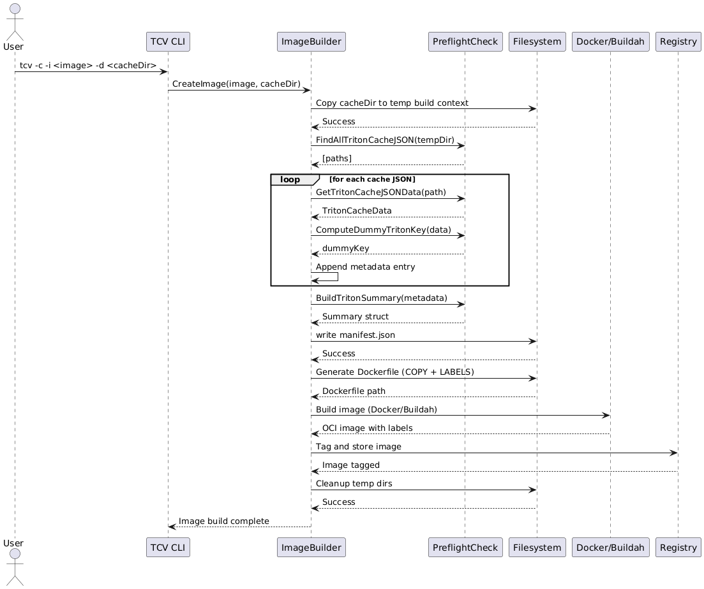
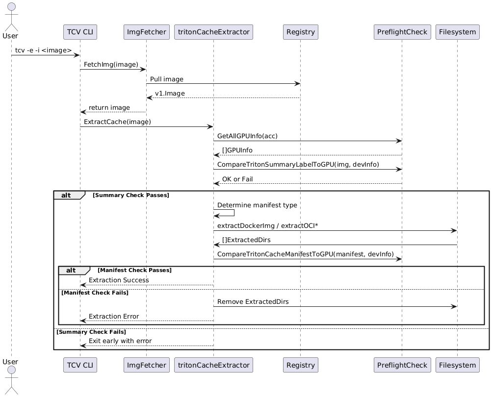

# Triton Cache Vault (TCV) - Design Document

## Overview

**TCV** (Triton Cache Vault) is a utility for packaging, validating,
and extracting prebuilt Triton kernel caches using OCI container
images. It supports GPU hardware preflight checks, cache manifest
validation, and developer-friendly debugging workflows.

## Goals

- Package prebuilt Triton kernel caches into OCI-compatible container images.
- Validate Triton kernel caches against the host GPU for compatibility.
- Support multiple container image formats, including Docker, OCI standard,
  and custom artifact types.
- Extract and validate cache contents via:
  - Kernel metadata summary (for fast checks)
  - Full manifest analysis (for detailed checks)

## Supported Image Formats
<!-- markdownlint-disable  MD013 -->
<!-- Teporarily disable MD013 - Line length to keep the table formatting  -->
| Format Type         | Description                         | Media Type(s)                                       | Support |
|---------------------|-------------------------------------|-----------------------------------------------------|---------|
| **Docker V2 Schema**| Standard Docker images              | `application/vnd.docker.image.rootfs.diff.tar.gzip` | ✅      |
| **OCI Standard**    | OCI images via tools like `buildah` | `application/vnd.oci.image.layer.v1.tar`            | ✅      |
<!-- markdownlint-enable MD013 -->

## Key Features

- **Cache Summary Validation**: Checks image metadata labels before
  extraction.
- **Full Manifest Validation**: Parses and validates a detailed manifest
  after extraction.
- **GPU Compatibility Checks**: Verifies compatibility of kernel cache
  against local GPUs using backend, architecture, warp size, and optionally
  PTX versions.
- **Clean Extraction**: Extracted kernels are cleaned up if they are not
  compatible.
- **Temporary Directories**: All staging operations occur in `/tmp/.tcv/*`
  to prevent host pollution.

## Image Label Schema

<!-- markdownlint-disable  MD013 -->
<!-- Teporarily disable MD013 - Line length to keep the table formatting  -->
| Label                              | Description                                      |
|------------------------------------|--------------------------------------------------|
| `cache.triton.image/summary`       | JSON summary of supported kernels                |
| `cache.triton.image/entry-count`   | Number of kernel entries in the image            |
| `cache.triton.image/variant`       | Indicates variant: e.g., `multi`, `compat`, etc. |
<!-- markdownlint-enable MD013 -->

## Workflow Summary

### Creating an Image

```bash
tcv -c -i quay.io/example/triton-kernel -d /path/to/.triton/cache
```

- Copies kernel cache into build context
- Writes manifest.json with entry metadata
- Builds Docker or OCI image using Docker or Buildah
- Labels image with summary + entry count

### Extracting and Validating

```bash
tcv -e -i quay.io/example/triton-kernel
```

- Downloads image
- Compares summary label to local GPU
- Extracts image if compatible
- Validates manifest
- Removes incompatible kernels if manifest fails

## Debugging & Logging

- Logging level configurable via `--log-level`
- Temporary cache lives under `/tmp/.tcv/`
- Kernel cache extracted under `~/.triton/cache/`

## Sequence Diagrams

### Image Creation



### Image Extraction


